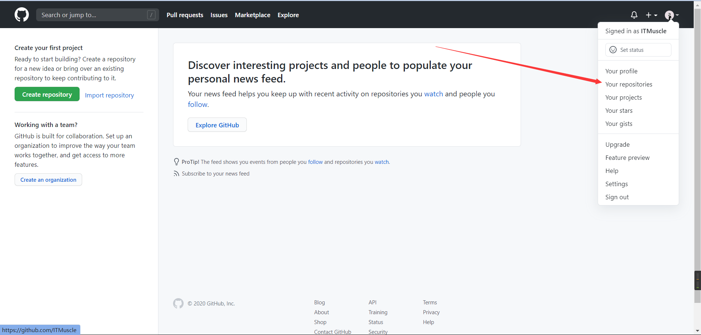
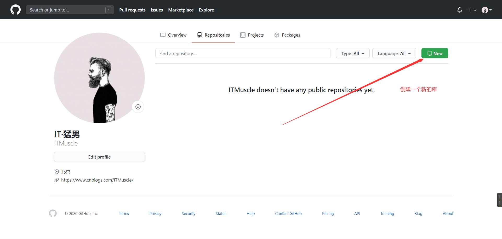
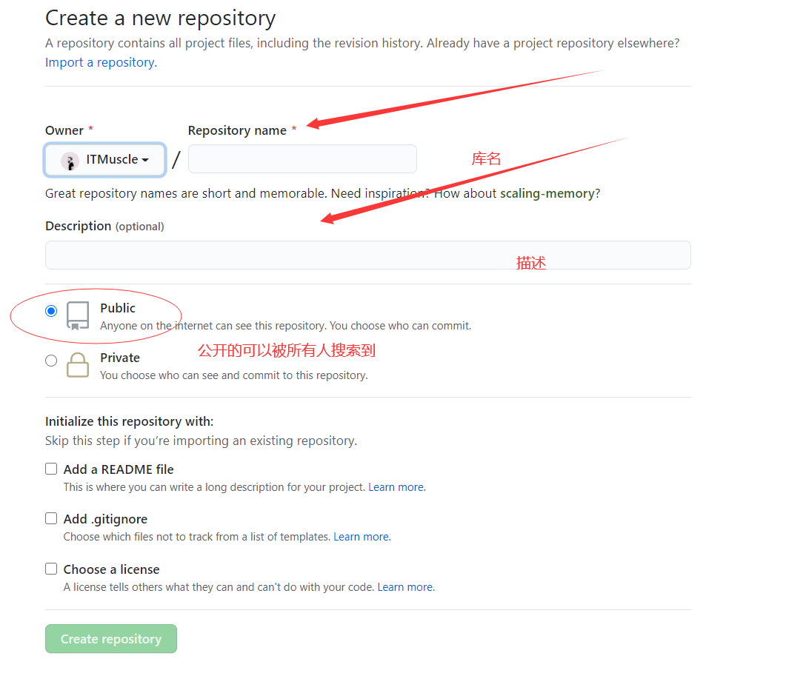
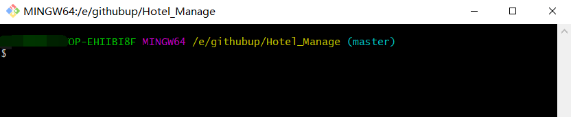
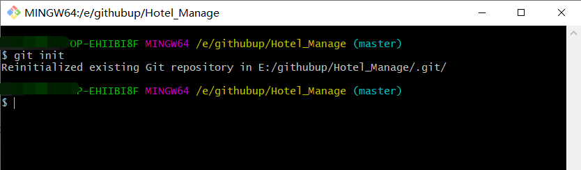
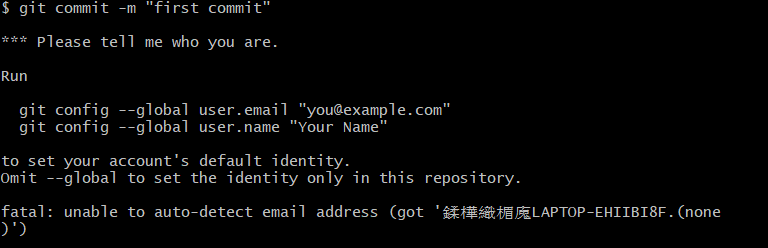
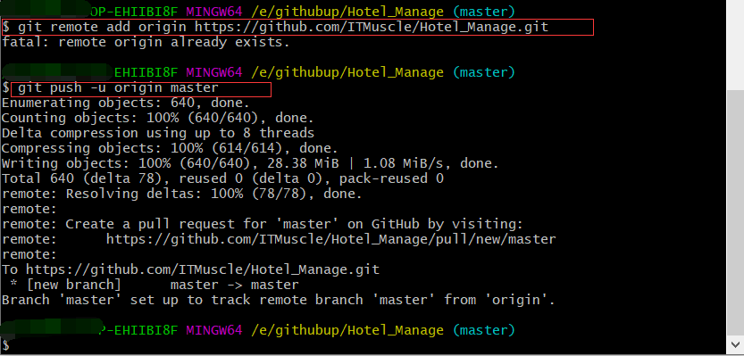

---
《Git使用教程（入门）》
转载自：https://www.cnblogs.com/ITMuscle/p/13780301.html
---

# 上传本地项目到GitHub

## 前言

*GitHub* 是一个面向开源及私有软件项目的托管平台，相信作为一个开发人员，或者是一个IT爱好者，使用*GitHub*定是必然的;

那么如何上传一个自己的项目到*GitHub*呢？本篇文章将带你一步步实现上传。

## 准备工作

首先得有自己的*GitHub*账号，如果没有可以去[GitHub官网](https://github.com/)申请注册一个；

然后就是需要一个Git工具，也可以去[Git官网](https://git-scm.com/downloads)下载最新版，然后安装（选择自己的安装路径，然后一直下一步就ok）。

## 步骤

### 新建仓库

1.注册好之后，点击头像，选择 Your repositories 新建一个仓库

2.然后点击 new，创建一个新的仓库

3.编写仓库的信息，然后提交创建

### 上传项目

1.打开刚刚下载安装好的Git工具，打开Git Bash，cd命令到自己的项目路径；

或者直接在文件管理中找到项目，右击选择Git Bash Here

2.使用 **git init** 命令将整个项目变成一个Git可管理的仓库

 此时在项目文件夹下就会多出一个 **.git**的文件夹，注意这个文件夹不要随便修改，否者可能会破坏Git仓库，导致以后的项目无法更 新，因为这个文件夹是跟踪管理版本库的

3.使用 **git add .** 命令将整个文件上传，或者也可以使用 **git add 文件名** 来上传单个文件

4.使用 **git commit -m "first commit"** 命令把项目提交到仓库；

*"first commit"* 字段可以自行定义，指本次提交的说明

 ps：在这一步，如果是第一次提交话会出现如下界面，只需要按照提示格式输入自己的邮箱和用户名，然后再次输入

 **git commit -m "first commit"** 命令即可

5.输入 **git remote add origin 自己仓库地址** 将本地仓库关联到*GitHub*；

 仓库地址可以在如下界面复制

 接着输入 **git push -u origin master** 将代码上传到*GitHub*。

 等待数秒完成上传，在此过程中可能会出现一个窗口让输入用户名密码，只需正确输入*GitHub*上的用户名和密码即可完成整个上传，最后可以登陆*GitHub*查看自己已经上传的项目

### 更新项目

当项目发布后，可能需要更新，这时可以通过以下命令进行项目更新

1. **git pull** 下载*GitHub*上的代码并合并，防止提交新代码的时候冲突报错
2. **git add** 将代码添加到仓库
3. **git commit -m "xxx"** 提交代码到仓库
4. **git push** 提交到*GitHub*

在最后附上我本次上传的项目地址：https://github.com/ITMuscle/Hotel_Manage