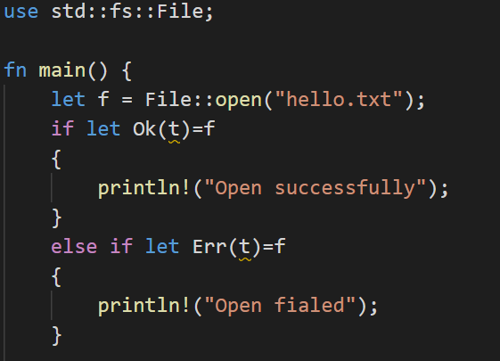
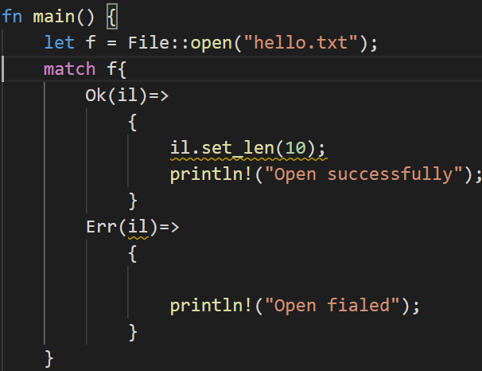

目录  
  内容总结  
    相关链接  
  所有权  
  组织管理  
  错误机制  

---


```c
/*------------------------------------------------------------
--------------------1st meeting's record----------------------
------Theme: K210's development environment introduction------
-------------------@nappingman On 2020.11.11------------------
------------------------------------------------------------*/
```

#### 内容总结

这一次汇报主要是对刚到手的Kendryte Sipeed Maix Dock进行了一些了解，对其开发环境（这里指的是在其自带的Freertos实时系统下的开发IDE）初步了解，目前看来对咱开发OS没啥作用，但是有兴趣的可以稍作了解，下面是一些工具链接：

##### 相关链接：

[Kendryte 官方的一款基于Visual Studio Code开发的IDE]: http://kendryte-ide.s3-website.cn-northwest-1.amazonaws.com.cn/
[IDE的Hello World入门]: https://xiangbingj.github.io/2019/05/12/k210_env/
[Linux下烧录工具Kflash]: https://github.com/sipeed/kflash_gui/releases
[Linux下串口工具minicom安装]: https://cn.maixpy.sipeed.com/zh/get_started/serial_tools.html
[Freertos开发书]: https://s3.cn-north-1.amazonaws.com.cn/dl.kendryte.com/documents/kendryte_freertos_programming_guide_20181012205800.pdf

[^Tips]: K210其他相关资料见pdf文件

------

```c
/*------------------------------------------------------------
--------------------2nd meeting's record----------------------
---------Theme: Rust语言的（所有权、）组织管理、错误机制---------
-------------------@nappingman On 2020.11.18------------------
------------------------------------------------------------*/
```


#### 所有权

1. 所有权的概念理解：所有权是用来处理内存回收问题的；

​	①在C/C++中内存管理需要显示编程，用户需要自己申请、释放内存，但是一般情况下即使没有及时释放内存也不会造成程序功能，这就造成了内存的浪费；

​	②在Java中，程序在虚拟机JVM中运行，JVM具有自动回收内存的功能，但这样对程序运行时效率降低；

​	通过三条规则引入所有权：

​	
2. 一般变量的作用范围就是所声明函数的范围，一旦超出，所有权将被收回；

3. 对于基本类型的变量，变量的数据内容存在于栈中，而对于其他类型的（比如不定长的string），其实际数据内容存在于堆中，在栈里面只存储了一个指向堆的指针；

4. 上述变量（string等类）在进行赋值操作时，等式右边的变量所有权将被等式左边的新变量夺走，从而导致旧变量不再可用

​	
5. 如果想要进行复制操作，不能单纯使用=赋值，which会连同所有权一并移交；需要使用.clone()方法，表现为==在堆中真实的复制一份数据==，所以复制之后的两个值都拥有自己的所有权；

6. 当==变量被当作参数传入函数==，对于==基本类型==的变量，调用了该函数之后，变量依旧可以使用；但对于像string这种类型的，被当作参数传入函数之后，就相当于所有权被转移了，如果==函数没有将所有权当作返回值传回、又或者这个变量没有接收这个返回值==，那么这个变量将不可用，且其所有权将在函数调用结束之际被回收；

7. 变量的引用&类似于指针

​	 
 
​		在内存中的表现是：在栈中存放s2变量的地方放一个指向（指向堆中存放s1地址的指针）；

​	 
8. 若引用的变量==在引用语句之后所有权被转移==，那么通过引用得到的变量会==失效==；

9. 既然引用相当于一种“租借”来的所有权，那么试图对其数据进行修改的语句都是非法的；除非使用一种特殊的==引用类型——&mut==，使用&mut修饰表明可变的引用类型；这同时引出了另一个问题：在普通引用的时候，一个变量可以有多个引用；但对于可变引用，只能有一个，不允许有多个可变引用指向一个变量；即多个可变引用涉及到了同步问题，在rust中成为“数据访问碰撞”；

10. “悬垂引用”——类似于没有实际指向一个能够访问数据的指针；在rust中还包括指向一个已经被释放的空间的（栈中的变量）；这种情况可能出现在将（一个以变量引用为返回值的函数返回值）赋值给（一个变量）——函数中的变量在函数调用结束后就被释放了，根据之前所知道的，当变量本身所有权失效之后，指向其的引用也自然失效，需要再次引用。


#### 组织管理

 
1. 首先，一个工程就是一个包package、包必须由一个 Cargo.toml 文件来管理，该文件描述了包的基本信息以及依赖项。

2. 独立的一个文件就是一个mod,文件名就是mod名；

3. 一个文件夹直接包含mod.rs ，如: `rust_mod_study/lip2/src/worker/mod.rs ;`则 worker就是模块名； 并且mod.rs为此模块的入口文件，此文件夹内的其他子模块都要在mod.rs中 `pub mod 模块名`，声明后，外部方可看到。
 
 
4. 通过use关键字使用模块，如果没有mod.rs文件，则在使用其他文件中的方法或子模块时，需要先把那个文件包成一个模块；其中关键字self表示在与本文件同级的目录中，super表示在父文件夹中

```rust
mod _file_name(无后缀)
use self::_file_name::_child_module_name;
```


#### 错误机制

1. 在rust中，对于错误类型分成了“可恢复错误”和“不可恢复错误”，在大多数编程语言中不做此区分；

2. 对于可恢复错误的处理是使用枚举类型Result<T,E>类来处理，不可恢复错误使用panic!宏直接终止线程，如果是主线程，则整个进程都终止；

3. Result<T,E>是一个带变量的枚举类，用来返回成功/错误信息的；

 
​	使用示例：打开文件

 
​	可以看到一般std库里面的函数返回值都是枚举变量Rusult，表示成功/失败；如果是成功的，就返回一个文件句柄，否则返	回一个错误类型的变量；

 
​	除了用if let{}语句，还可以使用类似于C里面的switch的叫做match的语法，和switch的区别就是比switch更安全，不需要程	序员显示地在每一个语句之后添加break；

 
4. 如果想要把可恢复的错误当作不可恢复来处理，可以使用以下两种方式；其实就是当返回值为Result类的Err时，调用panic!，expect多了可以传递一条指定错误信息；

 

5. 当出现错误时，返回值枚举类的变量类型是Error类型的，我们可以通过方法kind()获得具体的错误信息
