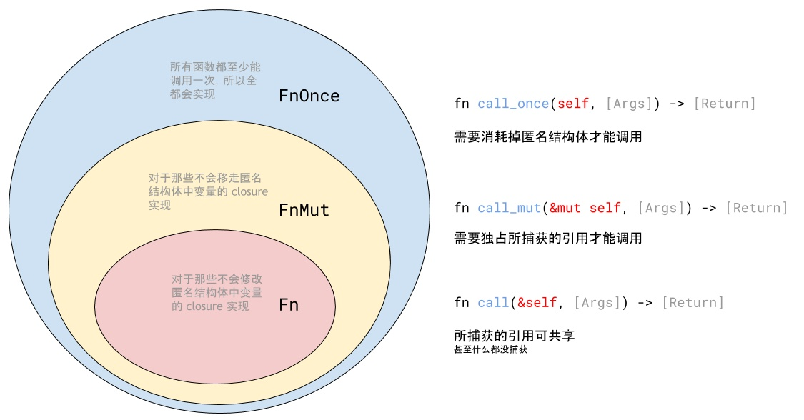
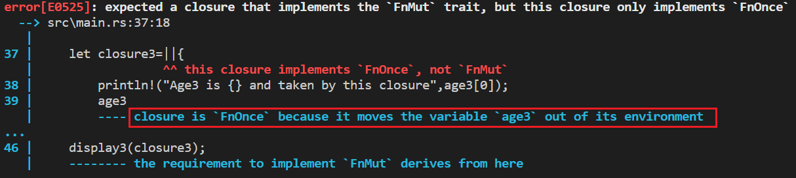

```c
/*------------------------------------------------------------
--------------------1st meeting's record----------------------
------Theme: K210's development environment introduction------
-------------------@nappingman On 2020.11.11------------------
------------------------------------------------------------*/
```

#### 内容总结

这一次汇报主要是对刚到手的Kendryte Sipeed Maix Dock进行了一些了解，对其开发环境（这里指的是在其自带的Freertos实时系统下的开发IDE）初步了解，目前看来对咱开发OS没啥作用，但是有兴趣的可以稍作了解，下面是一些工具链接：

##### 相关链接：

Kendryte 官方的一款基于Visual Studio Code开发的IDE：http://kendryte-ide.s3-website.cn-northwest-1.amazonaws.com.cn/  

IDE的Hello World入门：https://xiangbingj.github.io/2019/05/12/k210_env/  

Linux下烧录工具Kflash：https://github.com/sipeed/kflash_gui/releases  

Linux下串口工具minicom安装：https://cn.maixpy.sipeed.com/zh/get_started/serial_tools.html  

Freertos开发书：https://s3.cn-north-1.amazonaws.com.cn/dl.kendryte.com/documents/kendryte_freertos_programming_guide_20181012205800.pdf  

K210其他相关资料见docs文件夹  


------

```c
/*------------------------------------------------------------
--------------------2nd meeting's record----------------------
---------Theme: Rust语言的（所有权、）组织管理、错误机制---------
-------------------@nappingman On 2020.11.18------------------
------------------------------------------------------------*/
```


#### 所有权

1. 所有权的概念理解：所有权是用来处理内存回收问题的；

	①在C/C++中内存管理需要显示编程，用户需要自己申请、释放内存，但是一般情况下即使没有及时释放内存也不会造成程序功能，这就造成了内存的浪费；

	②在Java中，程序在虚拟机JVM中运行，JVM具有自动回收内存的功能，但这样对程序运行时效率降低；

	通过三条规则引入所有权：

	
2. 一般变量的作用范围就是所声明函数的范围，一旦超出，所有权将被收回；

3. 对于基本类型的变量，变量的数据内容存在于栈中，而对于其他类型的（比如不定长的string），其实际数据内容存在于堆中，在栈里面只存储了一个指向堆的指针；

4. 上述变量（string等类）在进行赋值操作时，等式右边的变量所有权将被等式左边的新变量夺走，从而导致旧变量不再可用；

5. 如果想要进行复制操作，不能单纯使用=赋值，which会连同所有权一并移交；需要使用.clone()方法，表现为==在堆中真实的复制一份数据==，所以复制之后的两个值都拥有自己的所有权；

6. 当==变量被当作参数传入函数==，对于==基本类型==的变量，调用了该函数之后，变量依旧可以使用；但对于像string这种类型的，被当作参数传入函数之后，就相当于所有权被转移了，如果==函数没有将所有权当作返回值传回、又或者这个变量没有接收这个返回值==，那么这个变量将不可用，且其所有权将在函数调用结束之际被回收；

7. 变量的引用&类似于指针

	 

	在内存中的表现是：在栈中存放s2变量的地方放一个指向（指向堆中存放s1地址的指针）； 

	 
8. 若引用的变量==在引用语句之后所有权被转移==，那么通过引用得到的变量会==失效==；

9. 既然引用相当于一种“租借”来的所有权，那么试图对其数据进行修改的语句都是非法的；除非使用一种特殊的==引用类型——&mut==，使用&mut修饰表明可变的引用类型；这同时引出了另一个问题：在普通引用的时候，一个变量可以有多个引用；但对于可变引用，只能有一个，不允许有多个可变引用指向一个变量；即多个可变引用涉及到了同步问题，在rust中成为“数据访问碰撞”；

10. “悬垂引用”——类似于没有实际指向一个能够访问数据的指针；在rust中还包括指向一个已经被释放的空间的（栈中的变量）；这种情况可能出现在将（一个以变量引用为返回值的函数返回值）赋值给（一个变量）——函数中的变量在函数调用结束后就被释放了，根据之前所知道的，当变量本身所有权失效之后，指向其的引用也自然失效，需要再次引用。


#### 组织管理

 
1. 首先，一个工程就是一个包package、包必须由一个 Cargo.toml 文件来管理，该文件描述了包的基本信息以及依赖项。

2. 独立的一个文件就是一个mod,文件名就是mod名；

3. 一个文件夹直接包含mod.rs ，如: `rust_mod_study/lip2/src/worker/mod.rs ;`则 worker就是模块名； 并且mod.rs为此模块的入口文件，此文件夹内的其他子模块都要在mod.rs中 `pub mod 模块名`，声明后，外部方可看到。

 
4. 通过use关键字使用模块，如果没有mod.rs文件，则在使用其他文件中的方法或子模块时，需要先把那个文件包成一个模块；其中关键字self表示在与本文件同级的目录中，super表示在父文件夹中

```rust
mod _file_name(无后缀)
use self::_file_name::_child_module_name;
```


#### 错误机制

1. 在rust中，对于错误类型分成了“可恢复错误”和“不可恢复错误”，在大多数编程语言中不做此区分；

2. 对于可恢复错误的处理是使用枚举类型Result<T,E>类来处理，不可恢复错误使用panic!宏直接终止线程，如果是主线程，则整个进程都终止；

3. Result<T,E>是一个带变量的枚举类，用来返回成功/错误信息的；

 

​		使用示例：打开文件	

 

​	可以看到一般std库里面的函数返回值都是枚举变量Rusult，表示成功/失败；如果是成功的，就返回一个文件句柄，否则返	回一个错误类型的变量；

 
	除了用if let{}语句，还可以使用类似于C里面的switch的叫做match的语法，和switch的区别就是比switch更安全，不需要程	序员显示地在每一个语句之后添加break；

 

4. 如果想要把可恢复的错误当作不可恢复来处理，可以使用以下两种方式；其实就是当返回值为Result类的Err时，调用panic!，expect多了可以传递一条指定错误信息；

 

5. 当出现错误时，返回值枚举类的变量类型是Error类型的，我们可以通过方法kind()获得具体的错误信息


---

```c
/*------------------------------------------------------------
--------------------3rd meeting's record----------------------
----------------Theme:Rust语言的结构体、trait------------------
-------------------@nappingman On 2020.11.------------------
------------------------------------------------------------*/
```

#### 结构体

###### ①结构体定义：

​	使用"变量:类型"键值对的方式声明成员变量，在初始化时亦可以通过这样实现；

```rust
//声明结构体
struct Site {
    domain: String,
    name: String,
    nation: String,
    found: u32
}
```

```rust
//声明实例
let runoob = Site {
    domain: String::from("www.runoob.com"),
    name: String::from("RUNOOB"),
    nation: String::from("China"),
    found: 2013
};
```


1. 当一个结构体中含有很多成员变量，而你只想创建一个与==已有的结构体实例只有些许差距的另一个实例==，那么可以使用==..runoob==更新语法，加在新实例声明语句之后；需要注意的是，使用该语法时，所声明的新实例必须要与参照实例==有至少一处以上的不同==！另外，在声明式，各成员变量的声明顺序可以与定义时的顺序不一致。

```rust
let site = Site {
    domain: String::from("www.runoob.com"),
    name: String::from("RUNOOB"),
    ..runoob
};
```

3. **结构体方法与函数：**	

   **①方法**

   首先，结构体的方法，第一个参数必须是&self ，不需要声明类型，因为self是一关键字，对方法的调用可以直接通过object.method_name()实现，括号中需要传入&self以外的参数；

   这里传入的是&self，只是因为我们在这个计算面积的方法里，只需要借用一下实例的成员变量的值而已，并不想要对这个实例进行==修改==、或者直接==获得这个结构体实例的所有权==——这两种情况下分别使用=="&mut self "、"self"==作为参数；一般情况下，只有在我们需要==将这个实例转化为另一种类型的实例时==，才需要用到以所有权为参数，这是为了==防止在旧实例被转换后还有语句尝试使用已经不存在的旧实例==；

   那么方法area是如何知道&self的类型？通过impl块名"Rectangle"，对应的结构体名；

   每个结构体都可以拥有多个impl块，也就是说结构体的方法or函数可以分开放在不同位置的impl块里，但块的名字要相同，与同结构体名！；

   当然，在impl块里，还可以声明不以"&self"这些为参数的——"结构体关联函数"；

```rust
struct Rectangle {
    width: u32,
    height: u32,
}

impl Rectangle {
    fn area(&self) -> u32 {
        self.width * self.height
    }
    //对于修改实例类型的方法，需要实例本身被声明成mutable的
    fn modify(&mut self)  {
        self.width+=1;
        self.height+=1;
    }
    //实现类型的转换，也就包括所有权的转让
    fn transform(self) -> Point{
        Point{length:self.width+self.height}
    }
}

fn main() {
    let mut rect1 = Rectangle { width: 30, height: 50 };
    println!("rect1's area is {}", rect1.area());
    rect1.modify();
    println!("rect1's area is {}", rect1.area());
    let dot=rect1.transform();
    println!("Rectange transform to Point, length is {}", dot.length);
    //此时运行下面的语句会发现报错，提示rect1已经被转换
    //let size = rect1.area();
}
```

###### 	②结构体关联函数：

​	函数与上面方法的区别是：方法依附于一个具体的实例，因为参数里必须要有&self；而函数可以不需要有&self参数，只需	要知道这个函数是在哪个impl块中声明的即可，调用时通过"块名::函数名"即可；

```rust
#[derive(Debug)]
struct Rectangle {
    width: u32,
    height: u32,
}

//在Rectangle块中声明结构体关联函数creat
impl Rectangle {
    fn create(width: u32, height: u32) -> Rectangle {
        //直接返回一个Rectangle类型结构体
        Rectangle { width, height }
    }
}

fn main() {
    let rect = Rectangle::create(30, 50);
    println!("{:?}", rect);
}
```

###### ③输出结构体（调试使用）

```rust
#[derive(Debug)]
//一定要导入调试库 #[derive(Debug)]
struct Rectangle {
    width: u32,
    height: u32,
}

fn main() {
    let rect1 = Rectangle { width: 30, height: 50 };

    println!("rect1 is {:?}", rect1);
    println!("rect1 is {:#?}", rect1)//如果属性较多的话可以使用另一个占位符 {:#?}
}
```

###### ④元组结构体：

对于一些频繁使用的简单结构体，可以通过简单的语句声明：

```rust
fn main() {
    struct Color(u8, u8, u8);
    struct Point(f64, f64);

    let black = Color(0, 0, 0);
    let origin = Point(0.0, 0.0);

    println!("black = ({}, {}, {})", black.0, black.1, black.2);
    println!("origin = ({}, {})", origin.0, origin.1);
}
```

#### 泛型

###### （大多可类比C++，暂时跳过）

#### 特性（trait）

###### ①理解：

​	从字面理解，特性，是对一类方法/函数的抽象总结，这些方法可能具体==对于不同的结构体有具体的实现==，我们将这些==具体	实现不同、依附结构体不同、但功能上类似的方法==总结放到一起，就叫做一个trait；

###### ②大致结构：

​	通过一个实例来清晰的了解一下；

​	首先有两个结构体如下：

```rust
pub struct NewsArticle {
    pub headline: String,
    pub location: String,
    pub author: String,
    pub content: String,
}

pub struct Tweet {
    pub username: String,
    pub content: String,
    pub reply: bool,
    pub retweet: bool,
}

```

​	对于这两类结构体，我们都想要有一个能够输出的功能函数，但是输出的具体内容不同，所以需要分别实现：

```rust
//分别实现打印功能
impl NewsArticle {
    fn summarize(&self) -> String {
        format!("{}, by {} ({})", self.headline, self.author, self.location)
    }
}

impl Tweet {
    fn summarize(&self) -> String {
        format!("{}: {}", self.username, self.content)
    }
}
```

​	好，我们想要做的就是，用一个通用的"接口"Summary，以便我们能够对任意实现了summarize方法的结构体实例都使用一	个简便的方法调用；也就是我们希望，通过object.summarize()能够直接根据相应类型而调用不同的summarize方法，那么这	个Summry，就是我们说的特性——Trait！

​	具体一点的实现：

```rust
//定义一个trait
//首先，声明一个名为Summary的特性，在里面继续声明该特性所包括的方法
pub trait Summary {
    //只是声明，不需要提供具体实现
    //具体实现落实到各个结构体
    fn summarize(&self) -> String;
}

//将各个结构体的impl块改成
//表示为NewsArticle实现特性Summary中的方法
impl Summary for NewsArticle {
    fn summarize(&self) -> String {
        format!("{}, by {} ({})", self.headline, self.author, self.location)
    }
}

//表示为Tweet实现特性Summary中的方法
impl Summary for Tweet {
    fn summarize(&self) -> String {
        format!("{}: {}", self.username, self.content)
    }
}
```

​	若要调用对应的方法：

```rust
println!("New article available! {}", article.summarize());
println!("1 new tweet: {}", tweet.summarize());
```

###### ③trait的默认实现

​	对于一个trait，有的结构体可能没有完全实现trait中包含的所有方法，那么在这种情况下，我们就需要为这些没有实现的结	构体定义一些默认实现；

​	注意：只有当结构体实例没有某个方法的实现时，才会调用trait中的默认；否则，结构体实例实现的方法会覆盖掉默认的；

```rust
pub trait Summary {
    //非默认实现，只声明，不提供实现
    fn summarize_author(&self) -> String;
	
    //默认实现，在trait中完成方法的声明、实现
    fn summarize(&self) -> String {
        //默认实现可以调用trait中的其他默认/非默认实现
        //但是结构体
        format!("(Read more from {}...)", self.summarize_author())
    }
}
```

###### ④trait做为传参（即传入一个==实现了指定特性的实例==）

​	比如，我需要以一个结构体实例作为参数，要求这个实例具有某种trait，以便我能够调用这种trait中的某些方法；

```rust
/*-----------------------------impl trait语法-----------------------------------------*/

//参数是一个拥有Summary特性的实例item

//1.只有一个trait参数
pub fn notify(item: impl Summary) {
    println!("Breaking news! {}", item.summarize());
}
//2.多个trait参数（此时两个实例可以为任意实现了Summary的类型！）
//无法指定两个实例为同一种类型！
pub fn notify(item1: impl Summary, item2: impl Summary) {
...
}
//3.实例item拥有多个trait
pub fn notify(item: impl Summary + Display) {
...
}


/*-----------------------------trait bound语法（利用泛性）-----------------------------*/

//参数是一个拥有Summary特性的实例item

//1.只有一个trait参数
pub fn notify<T: Summary>(item: T) {
    println!("Breaking news! {}", item.summarize());
}	
//2.多个trait参数（此时两个实例必须是同一种实现了Summary的类型！）
pub fn notify<T: Summary>(item1: T, item2: T) {
...
}
//3.实例item拥有多个trait
pub fn notify<T: Summary + Display>(item: T) {
...
}

//缺点：每个泛型有其自己的 trait bound，所以有多个泛型参数的函数在名称和参数列表之间会有很长的 trait bound 信息，这使得函数签名难以阅读。
fn some_function<T: Display + Clone, U: Clone + Debug>(t: T, u: U) -> i32 {
...
}

//使用where语句简化
fn some_function<T, U>(t: T, u: U) -> i32
    where T: Display + Clone,
          U: Clone + Debug
{
...
}
```

###### ⑤trait为返回值（即返回一个==实现了指定特性的实例==）

​	**注意，这种返回值方式只适用于单一类型的返回，也就返回值不能出现多种可能**

```rust
//返回值类型明确：Tweet类型的实例，可以！
fn returns_summarizable() -> impl Summary {
    Tweet {
        username: String::from("horse_ebooks"),
        content: String::from("of course, as you probably already know, people"),
        reply: false,
        retweet: false,
    }
}

//返回值可能为NewsArticle、也可能为Tweet，有多种可能，视if条件而定，不行！
fn returns_summarizable(switch: bool) -> impl Summary {
    if switch {
        NewsArticle {
            headline: String::from("Penguins win the Stanley Cup Championship!"),
            location: String::from("Pittsburgh, PA, USA"),
            author: String::from("Iceburgh"),
            content: String::from("The Pittsburgh Penguins once again are the best
            hockey team in the NHL."),
        }
    } else {
        Tweet {
            username: String::from("horse_ebooks"),
            content: String::from("of course, as you probably already know, people"),
            reply: false,
            retweet: false,
        }
    }
}
```

###### ⑥trait的作用域

​	以之前的例子来讲，我们声明的Summary特性，和我们声明的结构体NewsArticle、Tweet都是在同一个文件里（也就是同一	个module中），所以我们能够直接为NewsArticle、Tweet实现特性Summary中的方法；

​	但是当特性的声明和结构体不在同一个module中，比如，module_A中的结构体想为它的实例实现在module_B声明的一个名	为Method的特性，那么首先需要把这个特性通过use关键字"use::module_B::Method"，使得改特性在module_A中可用，然后	再完成相关实现；

​	这个限制是被称为 **相干性**（*coherence*） 的程序属性的一部分，或者更具体的说是 **孤儿规则**（*orphan rule*），其得名于不存	在父类型。这条规则确保了其他人编写的代码不会破坏你代码，反之亦然。没有这条规则的话，两个 crate 可以分别对相同	类型实现相同的 trait，而 Rust 将无从得知应该使用哪一个实现。

###### ⑦实现一个寻找最大值的泛型函数

​	将不同类型下的寻找最大值函数抽象出来，可以写出下面伪代码：

```rust
fn find_max<T> (array:&[T]) -> T{
    let mut max_element = array[0];
    if item>max_element{
        max_element = item;
     //比较，更新最大值   
    }
    return max_element;
}
```

​	但是即使完善了内部代码，编译还是会报错，这是因为我们在比较的过程中所用到的">"符号，并没有对泛型T中的所有类	型都实现了（比如，你随便定义了一个结构体，当然不能之间用">"来进行实例之间的比较，C++中需要重载运算符）；所	以，这里有两种不同的方案：

​	Ⅰ. 让find_max()函数只对实现了">"比较方法的类型适用，这样的话我们可以通过如下声明，限	制泛型T只能是已经实现       	了">"的类型：

```rust
fn find_max<T:Partial0rd>(array:&[T]){
    ...
}
```

​	但是这样依旧报错，问题出在赋值语句上

```rust
let mut max_element = array[0];
```

​	我们之前学所有权的时候已经知道，rust中，不同类型的变量储存的位置是不一样的；对于长度确定的一些基础类型，它们存放在栈中，而对于像字符串这类"变长"类型，数据是存放在堆里面的；这里的赋值语句相当于拷贝一份array[0]的值给max_element；问题就在于，我们不知道array[0]存在哪里，他可能是在栈里、也可能在堆里；对于 `i32` 和 `char` 这样的类型是已知大小的并可以储存在栈上，所以他们实现了 `Copy` trait，也就是能够直接赋值过去；当我们将 find_max函数改成使用泛型后，现在 array 参数的类型就有可能是没有实现 `Copy` trait 的。这意味着我们可能不能将 array[0]的值移动到 max_element变量中，这导致了上面的错误。

​	为了只对实现了 `Copy` 的类型调用这些代码，可以在 `T` 的 trait bounds 中增加 `Copy`！示例 10-15 中展示了一个可以编译的泛型版本的find_max 函数的完整代码，只要传递给 max_element的 slice 值的类型实现了 `PartialOrd` **和** `Copy` 这两个 trait，例如 `i32` 和 `char`：

```rust
//一个可以用于任何实现了 PartialOrd 和 Copy trait 的泛型的 find_max 函数
fn find_max<T: PartialOrd + Copy>(array: &[T]) -> T {
    let mut max_element = array[0];

    for &item in array.iter() {
        if item > max_element {
            max_element = item;
        }
    }

    max_element
}
```

​	Ⅱ.定义一种新的特性，相当于是C++中自定义结构体排序方式，只不过在Rust里我们把对于不同类型的比较方式都抽象到一个trait中；

```rust
//定义比较特性
trait Comparable {
    fn compare(&self, object: &Self) -> i8;
}
//为不同类型的数据实现具体比较方式
//这里是64位float
impl Comparable for f64 {
    fn compare(&self, object: &f64) -> i8 {
        if &self > &object { 1 }
        else if &self == &object { 0 }
        else { -1 }
    }
}
//一个适用于所有实现了Compareable特性类型寻找最值函数
fn max<T: Comparable>(array: &[T]) -> &T {
    let mut max_index = 0;
    let mut i = 1;
    while i < array.len() {
        if array[i].compare(&array[max_index]) > 0 {
            max_index = i;
        }
        i += 1;
    }
    &array[max_index]
}

fn main() {
    let arr = [1.0, 3.0, 5.0, 4.0, 2.0];
    println!("maximum of arr is {}", max(&arr));
}
```

---

```c
/*------------------------------------------------------------
--------------------6th meeting's record----------------------
---------------------Theme:Rust语言的闭包----------------------
-------------------@nappingman On 2020.12.14------------------
------------------------------------------------------------*/
```

#### 闭包

##### 理解闭包

先上一张图，理解之后觉得很形象：


为什么把闭包比喻成虫洞呢？

先看这个例子：

```rust
fn display<T>(age: u32, print_info: T)
    where T: Fn(u32)//约束闭包捕获的上下文是“不可变的”，类比实现结构体方法时提到的&self
{
    print_info(age);
}

fn main() {
    let name = String::from("Ethan");

    let print_info_closure = |age|{
        //捕获上文中的name变量
        println!("name is {}", name);
        println!("age is {}", age);
    };

    let age = 18;
    display(age, print_info_closure);
}
```

输出：

```
name is Ethan

age is 18
```

首先，闭包作为匿名函数存在了`print_info_closure`栈变量中，然后传递给了函数`display`作为参数，在`display`内部调用了闭包，并传递了参数`age`。最后神奇的事情出现了：在函数`display`中调用的闭包居然打印出了函数`main`作用域中的变量`name`。

**闭包的精髓，就在于它同时涉及两个作用域**，就仿佛打开了一个"虫洞"，让不同作用域的变量穿梭其中。

```rust
let x_closure = ||{};
```

单独一行代码，就藏着这个奥妙：

- 赋值`=`的左侧，是存储闭包的变量，它处在一个作用域中，也就是我们说的闭包**定义处**的环境上下文；
- 赋值`=`的右侧，那对花括号`{}`里，也是一个作用域，它在闭包**被调用处**动态产生；

无论左侧右侧，都定义了闭包的属性，天然的联通了两个作用域。


可能通过上面的例子，还不能很直观的了解啥是闭包，以我的理解：闭包可以当作函数，| |中为形参，{ }中为函数体，和普通函数的区别就是，这个函数没有名字；然而它又可以有名字，就是它把自己赋给一个变量，那么这个变量名便可以当作它的函数名，可直接通过`variable_name()`调用。

下面我们深入学习一下......

##### 闭包捕获上下文的不同类型

上面的例子中，提到了闭包捕获的是一个“不可变上下文”的环境，用泛型`Fn(u32)`还指明了其具体数据类型；

那么除了Fn，一共还有以下不同的方式/限制，类比实现结构体方法时提到的&self，&mut self，self，以及不带self的；

- 没有上下文的闭包就是一个函数指针。

- 带有不可变上下文（immutable context）的闭包属于`Fn`

- 带有可变上下文（mutable context）的闭包属于`FnMut`

- 拥有其上下文的闭包属于`FnOnce`

  

  来理解一下这四种闭包类型:

  ​	①fn/Fn  	 ：要么闭包没有捕获变量、要么捕获的都是基本类型（实现了Copy，存在栈中）

  ​	②FnMut	 ：

  ​	③FnOnce   ：

如果一个闭包只是在声明它的函数范围内使用，只需要遵守借用规则即可；

由于没有将上下文传递，所以可以当作普通函数来使用；

只有在闭包被当作参数传递时，才需要指明闭包的类型，当然，由上图中的几种类型的包含图，只需要满足指定类型包含/等于实际类型即可；

注意一下，我们在声明一个闭包的时候，并不会用到这些泛型限制，我们只需要指定：

​	①接收变量的类型（如果闭包内部对上下文中的变量进行修改，须指明成mut）

​	②| |中的形参（如果闭包内部对该形参进行了修改，须指明成mut）

​	③闭包可以没有返回值

==但是，在编译的时候，编译器会推断你的闭包属于这四种类型中的哪一个；比如你的闭包中最后一条语句是一个返回语句，把捕获的环境变量返回了，那么编译器便会infer，你这个闭包每次调用都会消耗环境变量，所以只能调用一次，为`FnOnce`，所以你在把这个闭包传入一个函数时，接受闭包的函数的boundary必须要设定成`FnOnce`，否则可以看到下面这个报错：==




##### 闭包作为函数使用

前面已经说了，作函数用时，函数名就是变量名；

参数类型以及返回值类型呢？

没有显示编程指定，这项工作交给编译器来做。当闭包第一次被调用时，传入参数类型以及返回值类型即为这个闭包的签名，之后的调用必须与第一次的类型相符；

##### 闭包生命周期

而相对而言，closure更像是一个可以被“调用”的变量。它具有和变量同样的“生命周期”。

###### 闭包底层实现原理

实际上，闭包可以通过一个结构体来模拟，解答以下两个问题，便能完全理解闭包原理：

1. 结构体内部的成员，应该用什么类型，如何初始化？应该用i32或是&i32还是&mut i32？
2. call函数调用的时候self应该用什么类型？应该写self或是&self还是&mut self？

[1]: https://zhuanlan.zhihu.com/p/23710601	"参考这篇文章吧，写的很好"


对于一个闭包，其捕获的变量、传入的参数都作为结构体的成员变量；

​	闭包内的逻辑语句，即为该结构体的impl方法块中的一个具体实现；

​	这个实现又分为不同种类，编译器通过对具体行为的推断，得出一个参数类型（不带self，&self，&mut self，self）；

​	

##### （理解上面的声明周期再来看这个）闭包作为函数参数

作为参数传入呢，就需要设计一个接收的函数了，之前提到的三个类型：`Fn,FnMut,FnOnce`就是用来描述这里的；

这三个类型具有包含关系：`FnOnce>FnMut>Fn`（之前看到一张图，居然把FnOnce画在最里面，误人子弟......）

所以使用后两者的地方换成`FnOnce`都是可以的；

这里有个点要理解：

接收FnOnce类型闭包的函数和闭包本身，都只能调用一次；

​		为什么——闭包本身以`self`方式传入结构体方法，方法调用结束后闭包自身的生命周期就结束了；	

而`Fn/FnMut`是被认定可以多次运行的，如果交还了捕获变量的所有权，则下次就不能运行了，所以会报出前面那个错误

```rust
fn display1 <F>(print:&F)//相当于&self，不可变
    where F:FnOnce()
    {
        print;//调用闭包
    }

fn display2 <F>(mut print:&F)
    where F:FnMut()
    {
        print;
        println!("can be called multiple times ");
        // print();
    }

fn display3 <F>(print:F)
    // 增加closure3的返回类型
    where F:FnOnce()->Vec<u32>
    // 加copy特性，约束成普通类型，则调用不受限制
    // where F:FnOnce() + Copy
    {
        print();
        println!("can't be called multiple times, 'cause the captured variable is already consumed ");
            // print();
    }
fn main(){

    let age1=10;
    let mut age2:Vec<i32>=vec![10];
    let age3:Vec<u32>=vec![10];

    let closure1=||{
        println!("Age1 is {}",age1);
    };
    let mut closure2=||{
        age2[0]=age2[0]+3;
        println!("Age2 is modifiede to {}",age2[0]);
    };
    let closure3=||{
        println!("Age3 is {} and taken by this closure",age3[0]);
        age3
    };
    // 调用display系列函数
    display1(&closure1);
    // closure1();
    // println!("display1 and closure1 can be called multiple times in main ");
    
     closure2();
    // closure2();
    display2(&closure2);
    display2(&closure2);
    println!("the variable 'age2: {}' captured by closure2 is still available in main ",age2[0]);
    
    display3(closure3);
    // println!("the variable 'age3' captured by closure2 is no longer available in main ");
    // println!("same as the closure3 itself in main ");
    // display3(closure3);
    // println!("{}",age3[0]);
}
```

##### 闭包作为函数返回值

当要返回一个闭包时，也就相当于返回一个匿名结构体，这个结构体的大小取决于闭包的参数、捕获的变量，所以是不确定的，不能直接return，需要用到`Box::new`装箱：

```rust

fn closure_inside() -> Box<dyn FnMut() -> ()>
{
    let mut age = 1;
    let mut name = String::from("Ethan");

    let age_closure = move || {
        name.push_str(" Yuan");
        age += 1;
        println!("name is {}", name);
        println!("age is {}", age);
    };

    Box::new(age_closure)
}

fn main(){
    let mut age_closure = closure_inside();
    age_closure();
    age_closure();
}
```

​	上面的代码，除了让函数成功返回闭包之外，还有一个目的，我们想让闭包捕获函数内部环境中的值，但这次有些不同：

- 第1节代码示例，我们把外层的环境上下文，通过将闭包传入内层函数，这个不难理解，因为外层变量的生命周期更长，内层函数访问时，外层变量还活着；
- 而本节代码所做的，是通过闭包将内层函数的环境变量传出来给外层环境；

内层函数调用完成后就会销毁内层环境变量，那如何做到呢？幸好，Rust有**所有权转移**。只要能促成内层函数的环境变量向闭包进行所有权的转移，这个操作顺理成章。

正因为Rust具有所有权转移的概念，返回闭包（同时捕获环境变量）的机理，Rust的要比任何具有垃圾回收语言（JavaScript、Java、C#）的解释都更简单明了。后者总会给人一丝不安：内部函数调用都结束了，居然局部变量还活着。

代码中的所有权转移，这里使用了关键字`move`，它可以在构建闭包时，强制以`by value`的方式，也就是把所有权都转移到闭包中。它可以在构建闭包时，强制将要捕获变量的所有权转移至闭包内部的特别存储区

需要注意的是，使用`move`，并不影响闭包的`trait`，本例中可以看到闭包是`FnMut`，而不是`FnOnce`。因为必报的`trait`是由编译器通过闭包具体的行为而推断的，而与它以何种方式捕获变量无关。