```c
/*------------------------------------------------------------
--------------------1st meeting's record----------------------
------Theme: K210's development environment introduction------
-------------------@nappingman On 2020.11.11------------------
------------------------------------------------------------*/
```

#### 内容总结

这一次汇报主要是对刚到手的Kendryte Sipeed Maix Dock进行了一些了解，对其开发环境（这里指的是在其自带的Freertos实时系统下的开发IDE）初步了解，目前看来对咱开发OS没啥作用，但是有兴趣的可以稍作了解，下面是一些工具链接：

##### 相关链接：

Kendryte 官方的一款基于Visual Studio Code开发的IDE：http://kendryte-ide.s3-website.cn-northwest-1.amazonaws.com.cn/  

IDE的Hello World入门：https://xiangbingj.github.io/2019/05/12/k210_env/  

Linux下烧录工具Kflash：https://github.com/sipeed/kflash_gui/releases  

Linux下串口工具minicom安装：https://cn.maixpy.sipeed.com/zh/get_started/serial_tools.html  

Freertos开发书：https://s3.cn-north-1.amazonaws.com.cn/dl.kendryte.com/documents/kendryte_freertos_programming_guide_20181012205800.pdf  

K210其他相关资料见docs文件夹  


------

```c
/*------------------------------------------------------------
--------------------2nd meeting's record----------------------
---------Theme: Rust语言的（所有权、）组织管理、错误机制---------
-------------------@nappingman On 2020.11.18------------------
------------------------------------------------------------*/
```


#### 所有权

1. 所有权的概念理解：所有权是用来处理内存回收问题的；

	①在C/C++中内存管理需要显示编程，用户需要自己申请、释放内存，但是一般情况下即使没有及时释放内存也不会造成程序功能，这就造成了内存的浪费；

	②在Java中，程序在虚拟机JVM中运行，JVM具有自动回收内存的功能，但这样对程序运行时效率降低；

	通过三条规则引入所有权：

	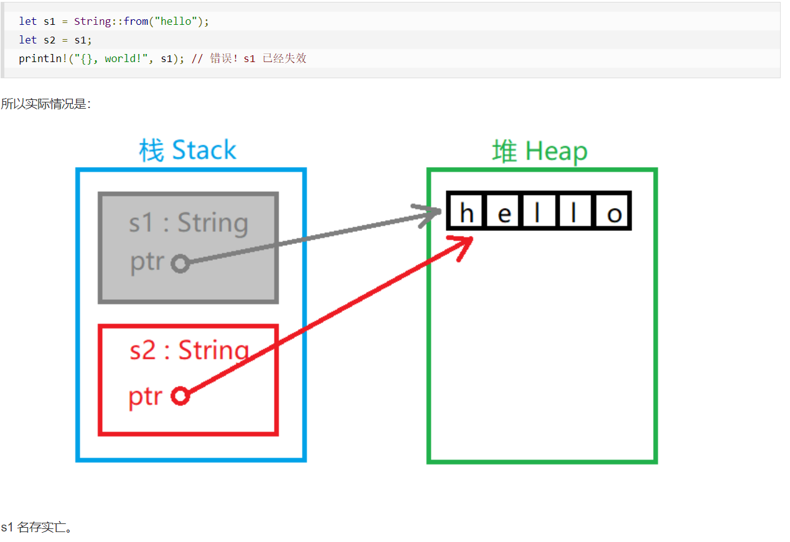
2. 一般变量的作用范围就是所声明函数的范围，一旦超出，所有权将被收回；

3. 对于基本类型的变量，变量的数据内容存在于栈中，而对于其他类型的（比如不定长的string），其实际数据内容存在于堆中，在栈里面只存储了一个指向堆的指针；

4. 上述变量（string等类）在进行赋值操作时，等式右边的变量所有权将被等式左边的新变量夺走，从而导致旧变量不再可用；

5. 如果想要进行复制操作，不能单纯使用=赋值，which会连同所有权一并移交；需要使用.clone()方法，表现为==在堆中真实的复制一份数据==，所以复制之后的两个值都拥有自己的所有权；

6. 当==变量被当作参数传入函数==，对于==基本类型==的变量，调用了该函数之后，变量依旧可以使用；但对于像string这种类型的，被当作参数传入函数之后，就相当于所有权被转移了，如果==函数没有将所有权当作返回值传回、又或者这个变量没有接收这个返回值==，那么这个变量将不可用，且其所有权将在函数调用结束之际被回收；

7. 变量的引用&类似于指针

	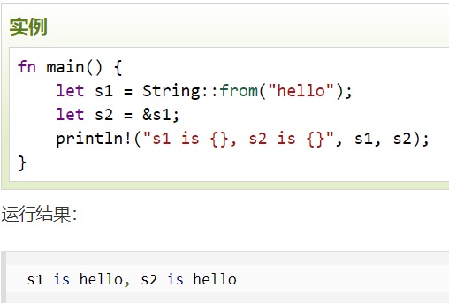 

	在内存中的表现是：在栈中存放s2变量的地方放一个指向（指向堆中存放s1地址的指针）； 

	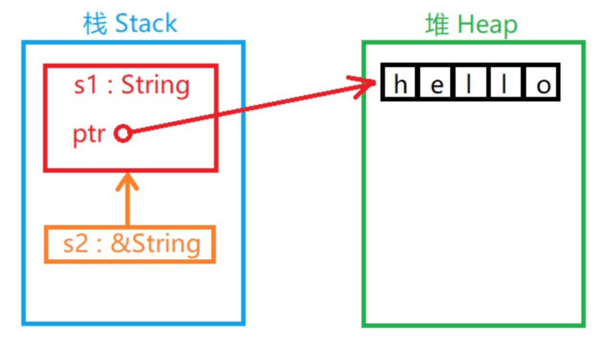 
8. 若引用的变量==在引用语句之后所有权被转移==，那么通过引用得到的变量会==失效==；

9. 既然引用相当于一种“租借”来的所有权，那么试图对其数据进行修改的语句都是非法的；除非使用一种特殊的==引用类型——&mut==，使用&mut修饰表明可变的引用类型；这同时引出了另一个问题：在普通引用的时候，一个变量可以有多个引用；但对于可变引用，只能有一个，不允许有多个可变引用指向一个变量；即多个可变引用涉及到了同步问题，在rust中成为“数据访问碰撞”；

10. “悬垂引用”——类似于没有实际指向一个能够访问数据的指针；在rust中还包括指向一个已经被释放的空间的（栈中的变量）；这种情况可能出现在将（一个以变量引用为返回值的函数返回值）赋值给（一个变量）——函数中的变量在函数调用结束后就被释放了，根据之前所知道的，当变量本身所有权失效之后，指向其的引用也自然失效，需要再次引用。

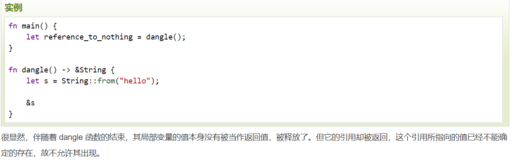


#### 组织管理

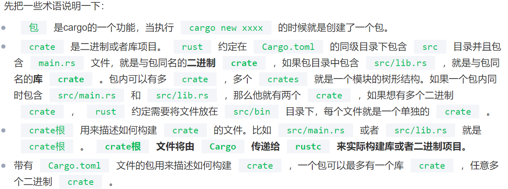 
1. 首先，一个工程就是一个包package、包必须由一个 Cargo.toml 文件来管理，该文件描述了包的基本信息以及依赖项。

2. 独立的一个文件就是一个mod,文件名就是mod名；

3. 一个文件夹直接包含mod.rs ，如: `rust_mod_study/lip2/src/worker/mod.rs ;`则 worker就是模块名； 并且mod.rs为此模块的入口文件，此文件夹内的其他子模块都要在mod.rs中 `pub mod 模块名`，声明后，外部方可看到。

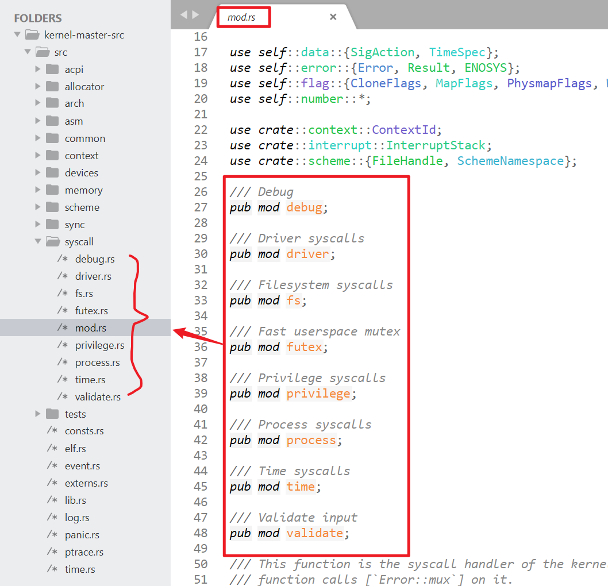 
4. 通过use关键字使用模块，如果没有mod.rs文件，则在使用其他文件中的方法或子模块时，需要先把那个文件包成一个模块；其中关键字self表示在与本文件同级的目录中，super表示在父文件夹中

```rust
mod _file_name(无后缀)
use self::_file_name::_child_module_name;
```


#### 错误机制

1. 在rust中，对于错误类型分成了“可恢复错误”和“不可恢复错误”，在大多数编程语言中不做此区分；

2. 对于可恢复错误的处理是使用枚举类型Result<T,E>类来处理，不可恢复错误使用panic!宏直接终止线程，如果是主线程，则整个进程都终止；

3. Result<T,E>是一个带变量的枚举类，用来返回成功/错误信息的；

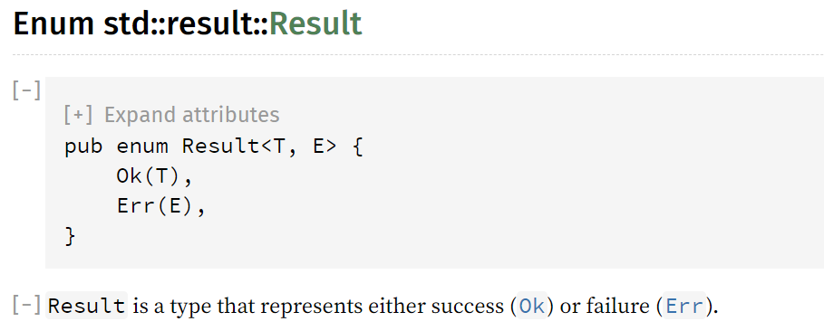 

​		使用示例：打开文件	

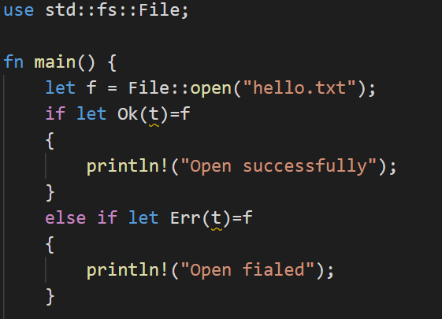 
	

​	可以看到一般std库里面的函数返回值都是枚举变量Rusult，表示成功/失败；如果是成功的，就返回一个文件句柄，否则返	回一个错误类型的变量；

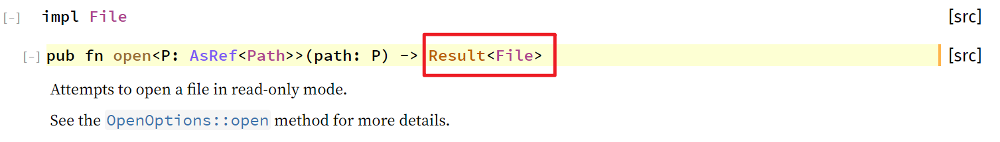 
	除了用if let{}语句，还可以使用类似于C里面的switch的叫做match的语法，和switch的区别就是比switch更安全，不需要程	序员显示地在每一个语句之后添加break；

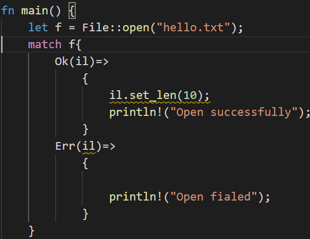 


4. 如果想要把可恢复的错误当作不可恢复来处理，可以使用以下两种方式；其实就是当返回值为Result类的Err时，调用panic!，expect多了可以传递一条指定错误信息；

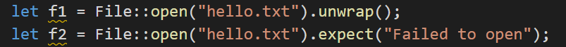 


5. 当出现错误时，返回值枚举类的变量类型是Error类型的，我们可以通过方法kind()获得具体的错误信息


---

```c
/*------------------------------------------------------------
--------------------3rd meeting's record----------------------
---------Theme:  ---------
-------------------@nappingman On 2020.11.------------------
------------------------------------------------------------*/
```

1. TLS（Thread-Local Storage）

   线程本地存储，是用来把一些静态/全局的变量，存在仅每个线程自己可见的区域，供自己使用，而不被其他线程所影响；举个例子更好理解：

   ​	比如说，在一个进程的n个线程中，都用到了某个系统调用，该系统调用在出错的情况下会把错误代码写入一个全局变量	error中，这在C标准库中很常见；由于每个线程都有可能在改系统调用的时候出错，从而修改全局变量error；所以如果全局变量只有一份，那么所有的线程都是共享的，则某个线程的系统调用可能会导致另一个线程先前设置的全局变量值被覆盖，而且在该线程处理这个错误事件之前；