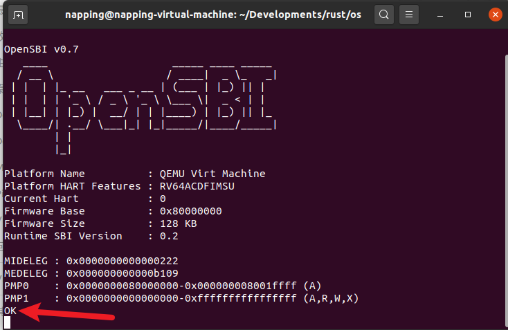
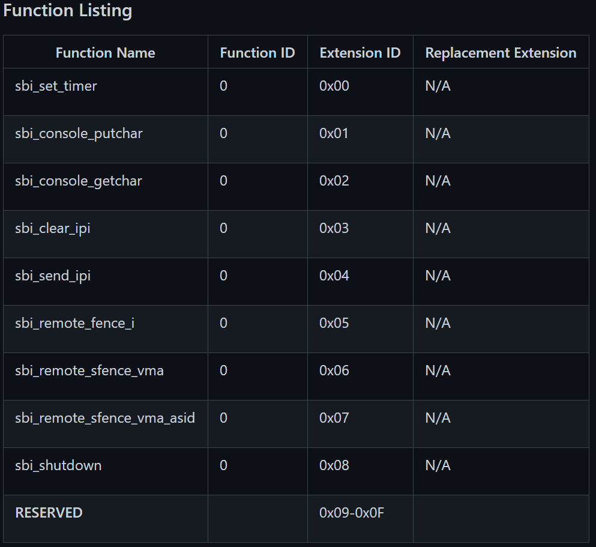

---
参考：https://rcore-os.github.io/rCore_tutorial_doc/
---


```c
/*------------------------------------------------------------
--------------------4th meeting's record----------------------
-------------------Theme: blog-os on RISCV--------------------
-------------------@nappingman On 2020.12.16------------------
------------------------------------------------------------*/
```

#### 1

参照`rcore`，实现把一个os编译得到riscv指令集架构下的一个可执行文件，并在qemu（和板子上）跑出来；

首先是在qemu上尝试。

##### 修改目标平台

```toml
命令行执行：
$ rustup target add riscv64imac-unknown-none-elf

或直接将target写入配置文件config中(.cargo/config)
# .cargo/config
[build]
target = "riscv64imac-unknown-none-elf"

安装工具集：
$ cargo install cargo-binutils
$ rustup component add llvm-tools-preview
Tips：使用Ubuntu20.04LTS时，工具可能都下载在主目录中的~/.cargo/bin目录下，需要把该路径加入PATH；或者下到其他地方的/.cargo/bin中，可以直接把文件移动过来。所以要注意一下吧，就是这个版本我之前把主cargo加入到PATH了，但是并没有对全局的项目起作用，导致我在其他package中cargo install都没下载到主cargo下，然后一直报错找不到xxx。
```

首先我们来看一下默认的目标三元组 **x86_64-unknown-linux-gnu** 的 **JSON** 文件描述，输入以下命令：

```
$ rustc -Z unstable-options --print target-spec-json --target x86_64-unknown-linux-gnu
```

```json
// x86_64-unknown-linux-gnu.json
{
  "arch": "x86_64",
  "cpu": "x86-64",
  "data-layout": "e-m:e-i64:64-f80:128-n8:16:32:64-S128",
  "dynamic-linking": true,
  "env": "gnu",
  "executables": true,
  "has-elf-tls": true,
  "has-rpath": true,
  "is-builtin": true,
  "linker-flavor": "gcc",
  "linker-is-gnu": true,
  "llvm-target": "x86_64-unknown-linux-gnu",
  "max-atomic-width": 64,
  "os": "linux",
  "position-independent-executables": true,
  "pre-link-args": {
    "gcc": ["-Wl,--as-needed", "-Wl,-z,noexecstack", "-m64"]
  },
  "relro-level": "full",
  "stack-probes": true,
  "target-c-int-width": "32",
  "target-endian": "little",
  "target-family": "unix",
  "target-pointer-width": "64",
  "vendor": "unknown"
}
```

可以看到里面描述了架构、 CPU 、操作系统、 ABI 、端序、字长等信息。

我们现在想基于 64 位 RISCV 架构开发内核，就需要一份 `riscv64` 的目标三元组。幸运的是，目前 Rust 编译器已经内置了一个可用的目标：`riscv64imac-unknown-none-elf`。

我们查看一下它的 JSON 描述文件：

```json
// riscv64imac-unknown-none-elf.json
{
  "abi-blacklist": [
    "cdecl",
    "stdcall",
    "fastcall",
    "vectorcall",
    "thiscall",
    "aapcs",
    "win64",
    "sysv64",
    "ptx-kernel",
    "msp430-interrupt",
    "x86-interrupt",
    "amdgpu-kernel"
  ],
  "arch": "riscv64",
  "code-model": "medium",
  "cpu": "generic-rv64",
  "data-layout": "e-m:e-p:64:64-i64:64-i128:128-n64-S128",
  "eliminate-frame-pointer": false,
  "emit-debug-gdb-scripts": false,
  "env": "",
  "executables": true,
  "features": "+m,+a,+c",
  "is-builtin": true,
  "linker": "rust-lld",
  "linker-flavor": "ld.lld",
  "llvm-target": "riscv64",
  "max-atomic-width": 64,
  "os": "none",
  "panic-strategy": "abort",
  "relocation-model": "static",
  "target-c-int-width": "32",
  "target-endian": "little",
  "target-pointer-width": "64",
  "vendor": "unknown"
}
```

我们来看它与默认的目标三元组有着些许不同的地方：

```json
"panic-strategy": "abort",

```

这个描述了 `panic` 时采取的策略。回忆上一章中，我们在 `Cargo.toml` 中设置程序在 `panic` 时直接 `abort` ，从而不必调用堆栈展开处理函数。由于目标三元组中已经包含了这个参数，我们可以将 `Cargo.toml` 中的设置删除了：

```json
-[profile.dev]
-panic = "abort"

-[profile.release]
-panic = "abort"
```

##### 生成内核镜像

我们之前生成的 *elf* 格式可执行文件有以下特点：

- 含有冗余的调试信息，使得程序体积较大；
- 需要对 *program header* 部分进行手动解析才能知道各段的信息，而这需要我们了解 *program header* 的二进制格式，并以字节为单位进行解析。

由于我们目前没有调试的手段，不需要调试信息；同时也不会解析 *elf* 格式文件，所以使用工具 `rust-objcopy` 从 `elf` 格式可执行文件生成内核镜像：

```
$ rust-objcopy target/riscv64imac-unknown-none-elf/debug/os --strip-all -O binary target/riscv64imac-unknown-none-elf/debug/kernel.bin

```

这里 `--strip-all` 表明丢弃所有符号表及调试信息，`-O binary` 表示输出为二进制文件。

至此，我们编译并生成了内核镜像 *kernel.bin* 。接下来，我们将使用 Qemu 模拟器真正将我们的内核镜像跑起来。不过在此之前还需要完成两个工作：**调整内存布局** 和 **重写入口函数** 。


##### 使用链接脚本指定程序内存布局

###### 编写链接脚本

我们使用 **链接脚本（linker script）**来指定程序的内存布局。创建一个文件 `src/boot/linker64.ld`：

```ld
// src/boot/linker64.ld

OUTPUT_ARCH(riscv)
ENTRY(_start)

BASE_ADDRESS = 0x80200000;

SECTIONS
{
    /* Load the kernel at this address: "." means the current address */
    . = BASE_ADDRESS;
    start = .;

    .text : {
        stext = .;
        *(.text.entry)
        *(.text .text.*)
        . = ALIGN(4K);
        etext = .;
    }

    .rodata : {
        srodata = .;
        *(.rodata .rodata.*)
        . = ALIGN(4K);
        erodata = .;
    }

    .data : {
        sdata = .;
        *(.data .data.*)
        edata = .;
    }

    .stack : {
        *(.bss.stack)
    }

    .bss : {
        sbss = .;
        *(.bss .bss.*)
        ebss = .;
    }

    PROVIDE(end = .);
}
```

###### 使用脚本链接

```toml
[target.riscv64imac-unknown-none-elf]
rustflags = [
    "-C", "link-arg=-Tsrc/boot/linker64.ld",
]
```

###### 重新编译，查看可执行文件

```assembly
$ cargo build
$ rust-objdump target/riscv64imac-unknown-none-elf/debug/os -h --arch-name=riscv64
arget/riscv64imac-unknown-none-elf/debug/os:    file format ELF64-riscv

Sections:
Idx Name          Size     VMA          Type
  0               00000000 0000000000000000
  1 .text         00001000 0000000080200000 TEXT
  2 .rodata       00000000 0000000080201000 TEXT
  3 .data         00000000 0000000080201000 TEXT
  4 .bss          00000000 0000000080201000 BSS
...
$ rust-objdump target/riscv64imac-unknown-none-elf/debug/os -d --arch-name=riscv64

target/riscv64imac-unknown-none-elf/debug/os:    file format ELF64-riscv


Disassembly of section .text:

0000000080200000 stext:
80200000: 41 11                            addi    sp, sp, -16
80200002: 06 e4                            sd    ra, 8(sp)
80200004: 22 e0                            sd    s0, 0(sp)
80200006: 00 08                            addi    s0, sp, 16
80200008: 09 a0                            j    2
8020000a: 01 a0                            j    0
        ...
```

##### 重写程序入口点

```assembly
# src/boot/entry64.asm

    .section .text.entry
    .globl _start
_start:
    la sp, bootstacktop
    call rust_main

    .section .bss.stack
    .align 12
    .global bootstack
bootstack:
    .space 4096 * 4
    .global bootstacktop
bootstacktop:
```

##### 加载内核映像

为了确信我们已经跑起来了内核里面的代码，我们最好在 `rust_main` 里面加一点东西。

```rust
// src/main.rs

#![feature(asm)]

// 在屏幕上输出一个字符，目前我们先不用了解其实现原理
pub fn console_putchar(ch: u8) {
    let ret: usize;
    let arg0: usize = ch as usize;
    let arg1: usize = 0;
    let arg2: usize = 0;
    let which: usize = 1;
    unsafe {
        asm!("ecall"
             : "={x10}" (ret)
             : "{x10}" (arg0), "{x11}" (arg1), "{x12}" (arg2), "{x17}" (which)
             : "memory"
             : "volatile"
        );
    }
}

#[no_mangle]
extern "C" fn rust_main() -> ! {
    // 在屏幕上输出 "OK\n" ，随后进入死循环
    console_putchar(b'O');
    console_putchar(b'K');
    console_putchar(b'\n');
    loop {}
}
```

这样，如果我们将内核镜像加载完成后，屏幕上出现了 OK ，就说明我们之前做的事情没有问题。

现在我们生成内核镜像要通过多条命令来完成，我们通过 `Makefile` 来简化这一过程。

```makefile
# Makefile

target := riscv64imac-unknown-none-elf
mode := debug
kernel := target/$(target)/$(mode)/os
bin := target/$(target)/$(mode)/kernel.bin

objdump := rust-objdump --arch-name=riscv64
objcopy := rust-objcopy --binary-architecture=riscv64

.PHONY: kernel build clean qemu run env

env:
    cargo install cargo-binutils
    rustup component add llvm-tools-preview rustfmt
    rustup target add $(target)

kernel:
    cargo build

$(bin): kernel
    $(objcopy) $(kernel) --strip-all -O binary $@

asm:
    $(objdump) -d $(kernel) | less

build: $(bin)

clean:
    cargo clean

qemu: build
    qemu-system-riscv64 \
        -machine virt \
        -nographic \
        -bios default \
        -device loader,file=$(bin),addr=0x80200000

run: build qemu
```

##### 仿真



##### 尝试烧录

烧是能烧，，但是没啥反馈

先得研究一下opensbi和u-boot

---

```c
/*------------------------------------------------------------
--------------------5th meeting's record----------------------
-------------------Theme: blog-os on RISCV--------------------
-------------------@nappingman On 2020.12.23------------------
------------------------------------------------------------*/
```

#### 2

##### OpenSBI提供的接口

OpenSBI 实际上不仅起到了 bootloader 的作用，还为我们提供了一些服务供我们在编写内核时使用。这层接口称为 SBI (Supervisor Binary Interface)，是 S-Mode 的 kernel 和 M-Mode 执行环境之间的标准接口。

我们查看 [OpenSBI 文档 # legacy sbi extension](https://github.com/riscv/riscv-sbi-doc/blob/master/riscv-sbi.adoc#legacy-sbi-extension-extension-ids-0x00-through-0x0f) ，里面包含了一些以 C 函数格式给出的我们可以调用的接口。


上一节中我们的 `console_putchar` 函数类似于调用下面的接口来实现的：

```c
void sbi_console_putchar(int ch)
```

而实际的过程是这样的：运行在 S 态的 OS 通过 ecall 发起 SBI 调用请求，RISC-V CPU 会从 S 态跳转到 M 态的 OpenSBI 固件，OpenSBI 会检查 OS 发起的 SBI 调用的编号，如果编号在 0-8 之间，则进行处理，否则交由我们自己的中断处理程序处理（暂未实现）。

执行 `ecall` 前需要指定 SBI 调用的编号，传递参数。一般而言，`a7(x17)` 为 SBI 调用编号，`a0(x10)`、`a1(x11)` 和 `a2(x12)` 寄存器为 SBI 调用参数：

> 编号在 `0-8` 之间的系统调用：
>
> 

执行 ecall 前需要指定系统调用的编号，传递参数。一般而言，$a_7$ 为系统调用编号，$a_0$，$a_1$，$a_2$ 为参数：

```rust
// src/sbi.rs

//! Port from sbi.h
#![allow(dead_code)]

#[inline(always)]
fn sbi_call(which: usize, arg0: usize, arg1: usize, arg2: usize) -> usize {
    let ret;
    unsafe {
        asm!("ecall"			//汇编代码——字符串形式
            : "={x10}" (ret)	//返回值
            : "{x10}" (arg0), "{x11}" (arg1), "{x12}" (arg2), "{x17}" (which)//输入参数
            : "memory"//提示编译器可能更改内存
            : "volatile");
    }
    ret
}
```

输出部分，我们将结果保存到变量 `ret` 中，限制条件 `{x10}` 告诉编译器使用寄存器 `x10`（即 `a0` 寄存器），前面的 `=` 表明汇编代码会修改该寄存器并作为最后的返回值。

输入部分，我们分别通过寄存器 `x10`、`x11`、`x12` 和 `x17`（这四个寄存器又名 `a0`、`a1`、`a2` 和 `a7`） 传入参数 `arg0`、`arg1`、`arg2` 和 `which` ，其中前三个参数分别代表接口可能所需的三个输入参数，最后一个**`which`** 用来区分我们调用的是哪个接口（SBI Extension ID）。这里之所以提供三个输入参数是为了将所有接口囊括进去，对于某些接口有的输入参数是冗余的，比如 `sbi_console_putchar` 由于只需一个输入参数，它就只关心寄存器 `a0` 的值。

```rust
const SBI_SET_TIMER: usize = 0;
const SBI_CONSOLE_PUTCHAR: usize = 1;
const SBI_CONSOLE_GETCHAR: usize = 2;
const SBI_CLEAR_IPI: usize = 3;
const SBI_SEND_IPI: usize = 4;
const SBI_REMOTE_FENCE_I: usize = 5;
const SBI_REMOTE_SFENCE_VMA: usize = 6;
const SBI_REMOTE_SFENCE_VMA_ASID: usize = 7;
const SBI_SHUTDOWN: usize = 8;

/// 向控制台输出一个字符
///
/// 需要注意我们不能直接使用 Rust 中的 char 类型
pub fn console_putchar(c: usize) {
    sbi_call(SBI_CONSOLE_PUTCHAR, c, 0, 0);
}

/// 从控制台中读取一个字符
///
/// 没有读取到字符则返回 -1
pub fn console_getchar() -> usize {
    sbi_call(SBI_CONSOLE_GETCHAR, 0, 0, 0)
}

/// 调用 SBI_SHUTDOWN 来关闭操作系统（直接退出 QEMU）
pub fn shutdown() -> ! {
    sbi_call(SBI_SHUTDOWN, 0, 0, 0);
    unreachable!()
}
```

