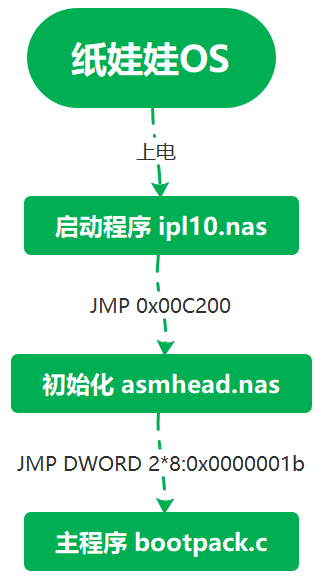
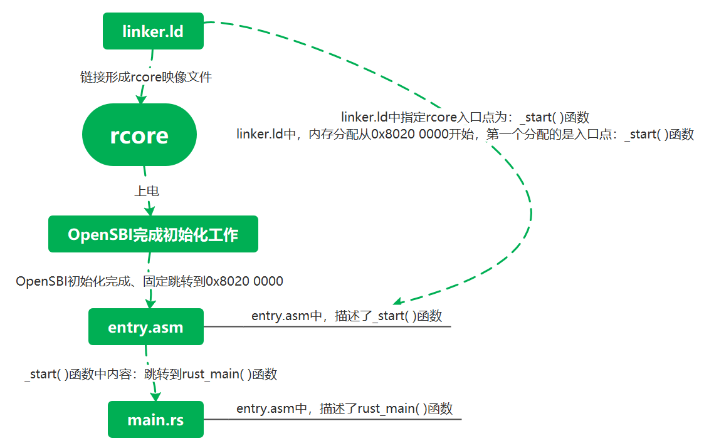

#### 纸娃娃`os`和`rcore`启动流程对照

##### 纸娃娃

（编程操作的全部为==内存地址==，分为`16-Bits`和`32-Bits`两种）

纸娃娃系统上电之后首先执行的是`ipl10.nas`——因为位于`0x7c00`启动扇区，`512-Bytes`且结尾最后`2-Bytes`为`0x55 AA`。

`ipl10.nas`和`asmhead.nas`是用来为纸娃娃操作系统内核程序运行做准备的、`bootpack.c`中可包含部分准备工作的执行：

- `ipl10.nas`——引导程序，所做的是把`10`个柱面的内容搬进内存，但注意，这个时候还没有`Day 8`的内存分布图，所以内容全部放在前面的`1M`内，`ipl10.nas`的工作便是如此，在搬运完之后，最后一条指令是`JMP 0xc200`——这是`asmhead.nas`所在的地方。
- `asmhead.nas`内，完成了几乎所有初始化的工作，包括：
  1. `VGA`画面模式设定；
  2. 中断初始化`PIC`；
  3. 设定临时`GDT`——包含3个段表条目（`bootpack`在第`2`个条目）；
  4. 实模式切换到保护模式——打开`A20`总线；
  5. 数据转移——从先前的`1M`内搬运数据；
  6. 准备程序运行时所需的栈；
  7. 数据转移完毕后，通过临时`GDT`跳转到`bootpack`执行，至此`asmhead.nas`工作结束；
- 中断的恢复、`GDT`的重建、`IDT`的创建在`bootpack`中执行，以上几项完成之后，`纸娃娃OS`才算完成了所有基本初始化的工作。

##### `rcore`

对于最初始的`rcore`，步骤如上图；

对于`rcore`的`qemu`模拟，由于有已经完善的固件——`OpenSBI`，所以主要工作放在上电后初始化之后；

- 生产`rcore`的映像文件之前，需要通过`linker.ld`稍作修改可执行文件中各种节顺序、而且还要更改最终生成映像文件中的内存分布；
- 得到`rcore`，上电运行，`OpenSBI`完成初始化，跳到固定地址`0x8020 0000`准备执行入口函数，由于我们在`linker.ld`中的设定，我们的入口函数是声明在`entry.asm`中的`_start`，这个函数便放在`0x8020 0000`中；
- 运行`_start`，在此例中，`_start`函数内只简单执行了`call rust_main`，即`main.rs`中的函数；
- 至此，已成功引导至`rcore`的主函数处；

对于最终的`rcore`，`linker.ld`和`entry.asm`没有变化，变化的是`rust_main`

